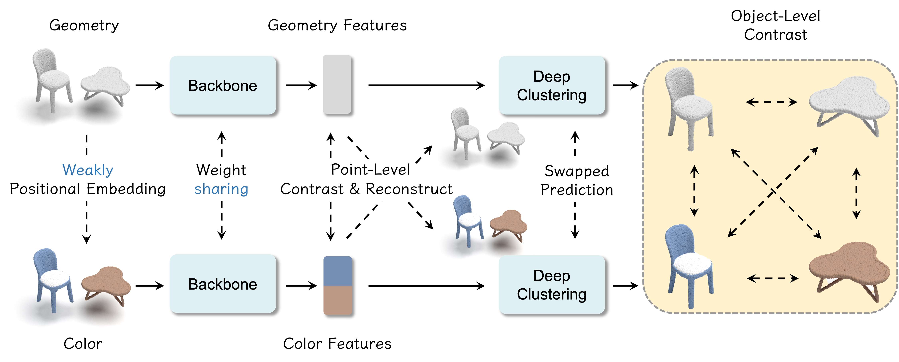

# Point-GCC: Geometry-Color Contrast
[](https://paperswithcode.com/sota/unsupervised-3d-semantic-segmentation-on?p=point-gcc-universal-self-supervised-3d-scene)\
[](https://paperswithcode.com/sota/3d-object-detection-on-s3dis?p=point-gcc-universal-self-supervised-3d-scene)\
[](https://paperswithcode.com/sota/3d-object-detection-on-sun-rgbd-val?p=point-gcc-universal-self-supervised-3d-scene)\
[](https://paperswithcode.com/sota/3d-object-detection-on-scannetv2?p=point-gcc-universal-self-supervised-3d-scene)

> [**Point-GCC: Universal Self-supervised 3D Scene Pre-training via Geometry-Color Contrast**](https://arxiv.org/abs/2305.19623) <br>
> [Guofan Fan](https://github.com/Asterisci), [Zekun Qi](https://scholar.google.com/citations?user=ap8yc3oAAAAJ), [Wenkai Shi](https://github.com/yibai-shi) and [Kaisheng Ma](http://group.iiis.tsinghua.edu.cn/~maks/leader.html) <br>

This repository contains the implementation of the paper **Point-GCC: Universal Self-supervised 3D Scene Pre-training via Geometry-Color Contrast**.

[arXiv](https://arxiv.org/abs/2305.19623)

## Point-GCC


For those interested, we update a **pre-release** [code](./code/README.md) of the preprint paper. Be careful to use it because lacks code cleanup and may be modified in final version.

## News
- 🎉 July, 2024: Point-GCC is accepted by ACMMM 2024, we will release offical version as soon, please check in [homepage](https://asterisci.github.io/Point-GCC/).
- 🔥 Oct, 2023: For those interested, we update a **pre-release** [code](./code/README.md) of the preprint paper.
- 💥 Jun, 2023: Check out our previous work [**Language-Assisted 3D**](https://arxiv.org/abs/2305.19623), [**ACT**](https://arxiv.org/abs/2212.08320), and [**ReCon**](https://arxiv.org/abs/2302.02318), which have been accepted by AAAI, ICLR, and ICML 2023 respectively.

## Cite

If you find our work helpful for your research. Please consider citing our paper.

```
@article{point-gcc,
  title={{Point-GCC:} Universal Self-supervised 3D Scene Pre-training via Geometry-Color Contrast},
  author={Fan, Guofan and Qi, Zekun and Shi, Wenkai and and Ma, Kaisheng},
  journal={arXiv preprint arXiv:2305.19623},
  year={2023}
}
```

## Acknowledgement

Our code is based on [MMDetection3D](https://github.com/open-mmlab/mmdetection3d/). Thanks for their wonderful work!

## License

Point-GCC is released under the MIT License. See the [LICENSE](./LICENSE) file for more details.
