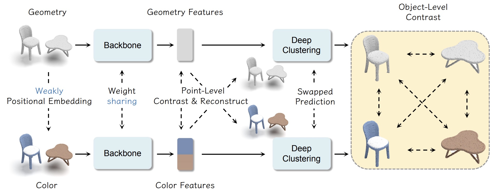

# Point-GCC: Geometry-Color Contrast

	
[](https://paperswithcode.com/sota/unsupervised-3d-semantic-segmentation-on?p=point-gcc-universal-self-supervised-3d-scene)\
[](https://paperswithcode.com/sota/3d-object-detection-on-s3dis?p=point-gcc-universal-self-supervised-3d-scene)\
[](https://paperswithcode.com/sota/3d-object-detection-on-sun-rgbd-val?p=point-gcc-universal-self-supervised-3d-scene)\
[](https://paperswithcode.com/sota/3d-object-detection-on-scannetv2?p=point-gcc-universal-self-supervised-3d-scene)

This repository contains the implementation of the paper [**Point-GCC: Universal Self-supervised 3D Scene Pre-training via Geometry-Color Contrast**](https://arxiv.org/abs/2305.19623).



Official Code is coming soon. 

## Cite

If you find our work helpful for your research. Please consider citing our paper.

```
@article{point-gcc,
  title={{Point-GCC:} Universal Self-supervised 3D Scene Pre-training via Geometry-Color Contrast},
  author={Fan, Guofan and Qi, Zekun and Shi, Wenkai and and Ma, Kaisheng},
  journal={arXiv preprint arXiv:2305.19623},
  year={2023}
}
```

## Acknowledgement

Our code is based on [MMDetection3D](https://github.com/open-mmlab/mmdetection3d/). Thanks for their wonderful work!

## License

Point-GCC is released under the MIT License. See the [LICENSE](./LICENSE) file for more details.
